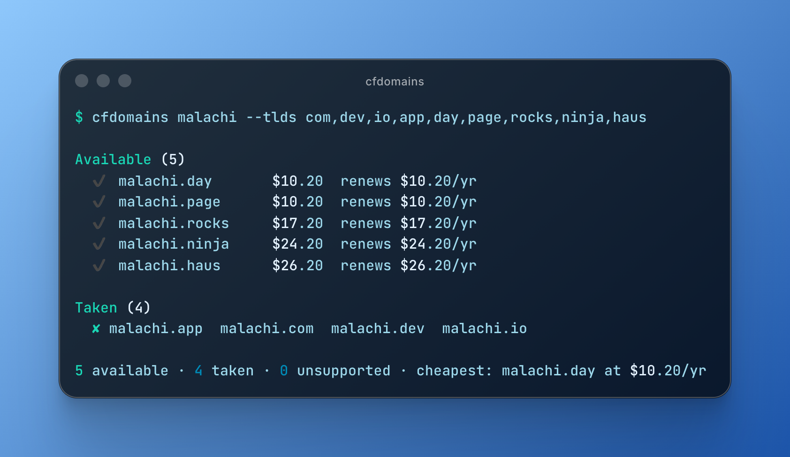
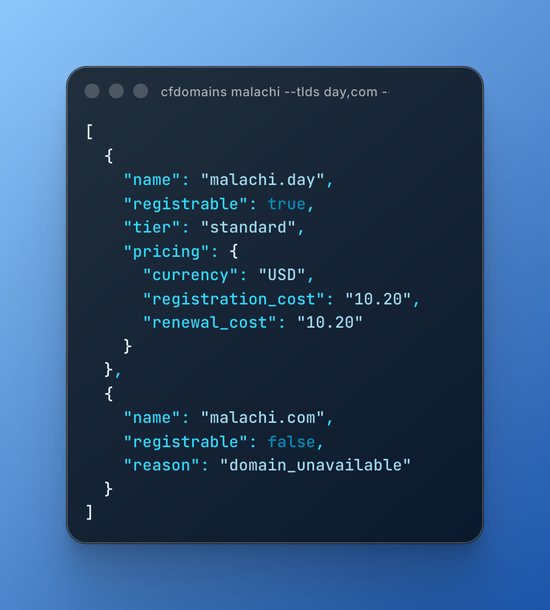

# cf-domain-search

Find out which `yourname.<tld>` domains are actually available — and what they really
cost — across all 423 [Cloudflare Registrar](https://developers.cloudflare.com/registrar/registrar-api/)
TLDs, in one command.

<p align="center">
  
</p>

Availability is authoritative — a live registry check through Cloudflare's Registrar API,
not a cached list — and prices are Cloudflare's at-cost prices (what you'd actually pay,
no markup).

## Quick start

```sh
npx cf-domain-search myname
```

That's it. On first run with no credentials, an interactive wizard walks you through
creating a Cloudflare API token, verifies it live, finds your account, and saves the
result to `~/.config/cf-domain-search/config.json`. Re-run it anytime with `cfdomains setup`.

Requires Node ≥ 20 and a free Cloudflare account. Not on npm yet? Run it from a clone:
`bun install && bun src/bin.ts myname`.

## Usage

```sh
cfdomains myname                    # sweep all 423 TLDs (takes a few seconds)
cfdomains myname --available        # only show the available ones
cfdomains myname --tlds com,dev,io  # check specific TLDs
cfdomains myname.dev                # exact single-domain check
cfdomains myname --json             # machine-readable output
cfdomains myname --live-tlds        # merge the latest TLD list from cfdomainpricing.com
```

Results come back in three groups:

- **Available** — sorted cheapest first, with registration and renewal prices; premium
  tiers are flagged.
- **Taken** — already registered.
- **Unsupported** — TLDs the beta API can't check yet. These may still be purchasable in
  the dashboard; the summary line prints the purchase URL.

Also built in: `--help`, `--version`, `--no-color` (or the `NO_COLOR` env var),
`--wizard` for guided flag entry, and `--completions bash|zsh|fish|sh`.

<details>
<summary>What <code>--json</code> looks like</summary>
<p align="center">
  
</p>
</details>

## Credentials

Credentials are looked up in this order — the wizard is only the last resort:

1. `--token` / `--account-id` flags
2. `CLOUDFLARE_API_TOKEN` / `CLOUDFLARE_ACCOUNT_ID` environment variables
3. a `.env` file in the working directory
4. the config saved by `cfdomains setup`

> [!IMPORTANT]
> The API token needs the **Account → Registrar Domains → Edit** permission — the beta
> API requires write scope even for read-only checks. Create one at
> <https://dash.cloudflare.com/profile/api-tokens>. Your account ID is the hex segment
> in your dashboard URL: `https://dash.cloudflare.com/<account-id>`.

## How it works

```
src/
  bin.ts          entrypoint — wires the command to NodeServices + FetchHttpClient layers
  Cli.ts          command definition, flag parsing, and the check/sweep orchestration
  Cloudflare.ts   Cloudflare API service: schemas, envelope decoding, transient retry
  Credentials.ts  credential resolution (env → .env → config file) and storage service
  Setup.ts        interactive wizard built on effect/unstable/cli Prompt
  Report.ts       pure rendering: grouping, sorting, money formatting
  Tlds.ts         embedded TLD list + live feed fetch
  Style.ts        minimal ANSI styling (honors NO_COLOR / non-TTY)
```

Written in [Effect v4](https://effect.website) with `effect/unstable/cli`, typechecked by
TypeScript 7 (tsgo) with the [Effect language service](https://github.com/Effect-TS/tsgo).
Services follow the v4 `Context.Service` class pattern with static layers.

A full sweep checks 20 domains per request, 5 requests at a time, and retries transient
failures (408/429/5xx) with exponential backoff — the Registrar API rate-limits
aggressively. A failed batch is reported and turns the exit code non-zero, but never
aborts the rest of the sweep.

The embedded TLD list comes from <https://www.cloudflare.com/tld-policies/> (Aug 2026);
`--live-tlds` unions in <https://cfdomainpricing.com/prices.json> at runtime. The API can
also register domains (`POST /registrar/registrations`), but this tool deliberately only
searches.

## Development

```sh
bun install        # also applies the effect-tsgo patch (prepare script)
bun run check      # tsc 7 --noEmit with Effect diagnostics
bun run build      # bundle src/bin.ts → dist/cfdomains.js (self-contained, no deps)
```

The README screenshots are generated from real output with
[ray.so](https://ray.so) via `scripts/screenshots.ts`.

### Publishing

`prepack` runs the typecheck and build, shipping `dist/` with bins `cf-domain-search` and
`cfdomains`. Verify locally with `npm pack` and
`npx --yes --package=./cf-domain-search-0.2.0.tgz cf-domain-search myname`, then
`npm publish`.

## License

MIT © Ricardo Escobar
